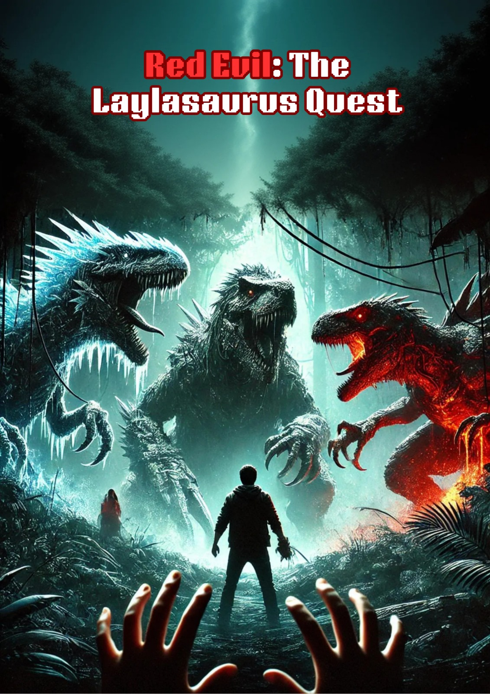

# 👩🏻‍🦰 Red Evil: The Laylasaurus Quest 🦖🧕 - 2D Demo



### Authors 
- Sakka Mohamad-Mario 1231EB 🚶
- Zafar Azzam 1231EB 🖼
- Al-Khalidy Essam 1231EB :gun:
- Mirghani Mahmoud Abdelrahman Mahmoud 1231EB ✍ 

### Description
In 2024, an unprecedented catastrophe strikes humanity: people begin transforming into dinosaurs! Mario, an ordinary university student, is the first to witness it when his friend and classmate, Layla, turns into one of these ancient creatures. As institutions fall and chaos spreads, people around Mario morph into ferocious dinosaurs, leaving destruction in their wake. But here’s the twist—Layla retains her memories, and she can help Mario find the root of this phenomenon! Join Mario and Layla on a thrilling journey as they search for the source of this mysterious transformation and fight to save humanity from extinction.


### Gameplay

- W-A-S-D for movement, the map has 5 scenes in the shape of a cross
- At the start you spawn in the southern scene and you have to travel north to get to the middle one and then you can move west, north, east to find the bosses
- Left click to shoot (there's a delay for the player ~1 second)
- While holding the gun, player can't move
- [Gameplay Video](https://www.youtube.com/watch?v=3qEAZw01-Ew&list=PLf34LpXku6i9rz5etayFc05nwu3NNGW3M)

### Tasks Distribution

- Sakka Mohamad-Mario: Implemented rendering of characters (NPC & Main), implemented movemement & scene transitions, improved character and scene classes, cleaned code at the end
- Zafar Azzam: Implemented the rendering of 2D textures, simplified creation of characters and scenes by writing classes for them
- Al-Khalidy Essam: Implemented shooting projectiles , collisions & damage system
- Mirghani Mahmoud: Created assets, poster & story

### Technical Details

- Shooting System: We use the cursor's position on the window to determine the target of the projectiles, we first have to get their positions in pixels then compute the normalized coordinates

```cpp
// Get the normalized coordinates of the cursor on the window
float x_normalized = ((2.0f * xpos) / width) - 1.0f;
float y_normalized = 1.0f - ((2.0f * ypos) / height);

// Create target vector to which the projectile has to travel
glm::vec3 target(x_normalized, y_normalized, 0.0f);
```

- Collision System: This system uses Axis-Aligned Bounding Box (AABB) collision detection to determine if a projectile collides with a character. Each character type has a predefined rectangular hitbox aligned with the coordinate axes, defined by boundaries (left, right, top, bottom) based on its position and dimensions. There's a function named `isProjectileCollidingWithCharacter` which is called every frame when the current scene is rendered, and it checks whether the position of the projectile is inside the bounding boxes of characters, each character type has its own bounding box

```cpp
// Check if projectile is within the hitbox boundaries
return (projectilePosition.x > left && projectilePosition.x < right &&
    projectilePosition.y > bottom && projectilePosition.y < top);
```

- Damage System: When collision is detected, damage is applied to the character that was hit, and the projectile is deleted so it doesnt persist in order to hit multiple targets

- Movement System: Pressing any of the WASD keys or combos of them changes the orientation of the rectangle on which the main character is drawn. We apply a rotation matrix before translating the character's rectangle that rotates it by a computed angle. This computed angle is given by the function `computeOrientationAngle` (counterclockwise), which returns an angle based on the detected combos of pressed keys. By default the angle at which the character's rectangle is rotated is zero, making it face upwards

